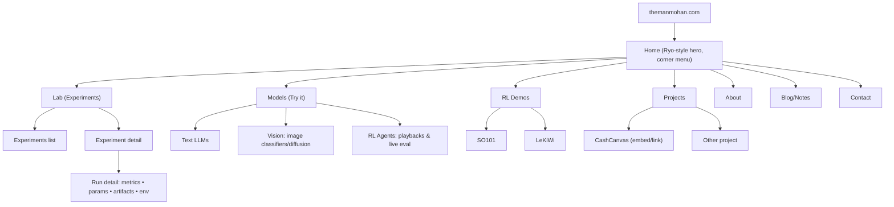
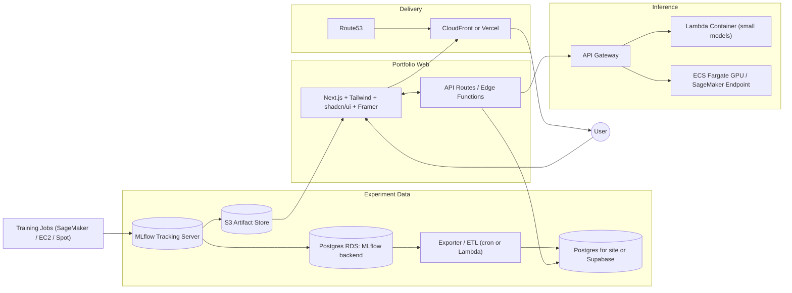
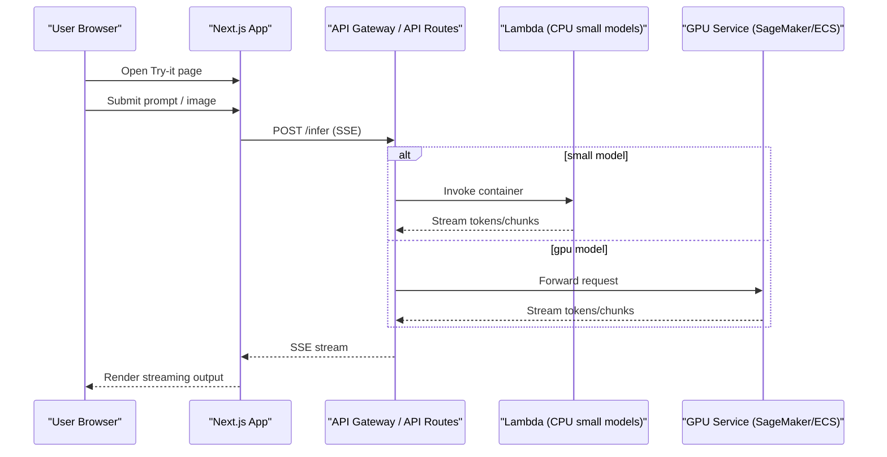
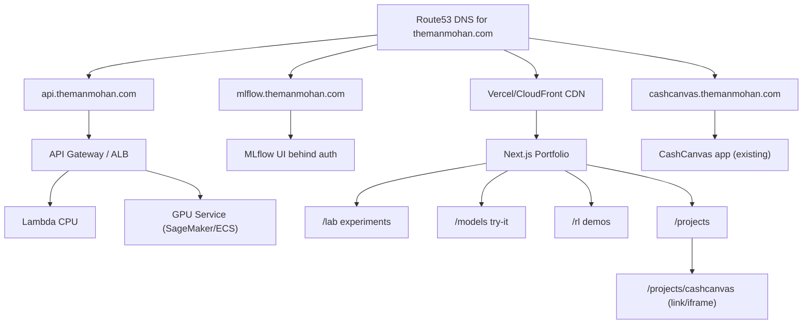
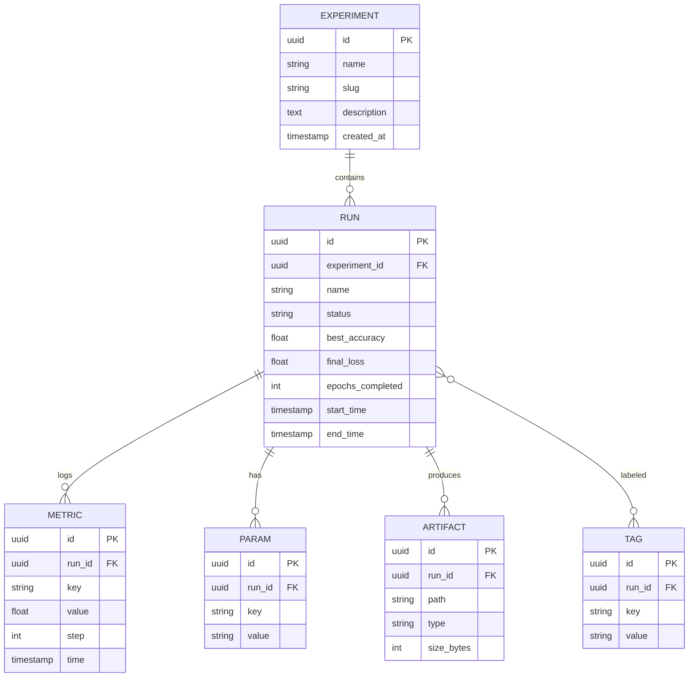

## themanmohan.com — Portfolio + ML Lab Project Plan

This document is designed so a capable LLM or engineer can implement the entire site from scratch with minimal back‑and‑forth. It includes sitemap, page specs, visual system, file structure, architecture, data model, infra plan, and a step‑by‑step build checklist optimized for fast, responsive performance.

### Goals
- Showcase ML experiments and runs like `neuralripper.com` while keeping a tasteful, minimal portfolio feel similar to `ryo.lu`.
- Provide interactive inference for trained/finetuned models (text, vision, simple RL eval playback/live eval).
- Host existing projects like `CashCanvas` under the main domain.
- Ship quickly, keep costs low (~$200 training budget), and favor statically cached or streamed experiences for speed.

### Primary References
- Experiments and runs inspiration: `https://neuralripper.com/`
- Portfolio taste and corner-triggered navigation: `https://ryo.lu/`

---

## Information Architecture and Sitemap



---

## Visual System (mobile-first, Ryo-inspired)
- Typography: heavy display grotesk for hero (e.g., Space Grotesk/Inter/Satoshi Black). Monospace for metadata blocks.
- Palette: dark base (#0B0F14), high-contrast white, neon accent for status (mint/teal or magenta) with subtle glows.
- Components:
  - KPI tiles: Accuracy, Loss, Epochs, Learning Rate, Status (color-coded).
  - Panels: Core Training, Model Architecture, System Hardware, Data Pipeline, Environment, Other.
  - Plots: Train/Val Loss, Accuracy, Epoch Time, Confusion Matrix; use dynamic imports for charts to keep TTI fast.
- Motion: minimal but intentional. Corner menu reveals with spring scale; plot hover tooltips fade.
- Accessibility: high contrast, prefers-reduced-motion fallbacks, keyboard reachable corner menu.

---

## Page-by-Page Specs

### Home `/`
- Immersive black hero with one sentence identity. Top-right “corner fold” opens the global menu.
- Below fold: three blocks
  - Latest Experiment highlight (best accuracy/status badge)
  - Featured Model (Try it) with a tiny inline prompt box
  - Projects (CashCanvas card)

### Lab `/lab`
- Experiments list: searchable, filter by tags/status; show quick stats (runs, best acc, last updated).
- Use ISR (revalidate ~30–60s) to feel instant while staying cheap.

### Experiment detail `/lab/[experimentSlug]`
- Panels: description, core settings, architecture, dataset, environment.
- Runs table with status, best metrics, updated time.

### Run detail `/lab/[experimentSlug]/[runId]`
- KPI tiles at top (Accuracy, Loss, Epochs, LR, Status).
- Panels grid: Core Training, Model Architecture, System Hardware, Data Pipeline, Environment, Other.
- Charts: loss/accuracy over steps, epoch time. Download links for artifacts.

### Models `/models`
- Cards for available models grouped by modality: Text, Vision, RL.

### Try‑it pages `/models/[modelSlug]`
- Simple prompt/image input. Stream result via SSE. Show model card with size, device, latency.

### RL Demos `/rl`, `/rl/so101`, `/rl/lekiwi`
- Short intro text, demo video/gif, “Evaluate now” button.
- For interactive demos: small web canvas or playback slider, logs overlay.

### Projects `/projects`
- Cards for `CashCanvas` and others. CashCanvas opens at `cashcanvas.themanmohan.com` or embeds via iframe.

### About / Blog / Contact
- Minimal pages. Blog supports MDX; Contact uses mailto or simple form->email.

---

## Architecture



### Inference Sequence (Streaming)


### DNS/Subdomain Map


---

## Data Model (App DB for fast reads)



### SQL (Supabase/Postgres)
```sql
create table if not exists experiment (
  id uuid primary key default gen_random_uuid(),
  name text not null,
  slug text unique not null,
  description text,
  created_at timestamptz not null default now()
);

create table if not exists run (
  id uuid primary key default gen_random_uuid(),
  experiment_id uuid not null references experiment(id) on delete cascade,
  name text not null,
  status text not null,
  best_accuracy double precision,
  final_loss double precision,
  epochs_completed integer,
  start_time timestamptz,
  end_time timestamptz
);
create index if not exists idx_run_experiment on run(experiment_id);
create index if not exists idx_run_status on run(status);

create table if not exists metric (
  id uuid primary key default gen_random_uuid(),
  run_id uuid not null references run(id) on delete cascade,
  key text not null,
  value double precision not null,
  step integer not null,
  time timestamptz not null default now()
);
create index if not exists idx_metric_run_key_step on metric(run_id, key, step);

create table if not exists param (
  id uuid primary key default gen_random_uuid(),
  run_id uuid not null references run(id) on delete cascade,
  key text not null,
  value text not null
);
create index if not exists idx_param_run_key on param(run_id, key);

create table if not exists artifact (
  id uuid primary key default gen_random_uuid(),
  run_id uuid not null references run(id) on delete cascade,
  path text not null,
  type text,
  size_bytes bigint
);
create index if not exists idx_artifact_run on artifact(run_id);

create table if not exists tag (
  id uuid primary key default gen_random_uuid(),
  run_id uuid not null references run(id) on delete cascade,
  key text not null,
  value text not null
);
create index if not exists idx_tag_run_key on tag(run_id, key);
```

---

## Repo Structure (Next.js app)

```
apps/
  portfolio/                 # Next.js site (Vercel-ready)
    app/                     # App Router
      layout.tsx
      page.tsx               # Home
      lab/
        page.tsx             # Experiments list
        [experiment]/
          page.tsx           # Experiment detail
          [run]/
            page.tsx         # Run detail
      models/
        page.tsx             # Model cards
        [model]/
          page.tsx           # Try-it page
      rl/
        page.tsx
        so101/page.tsx
        lekiwi/page.tsx
      projects/page.tsx
      about/page.tsx
      blog/                   # MDX posts
    components/
      ui/                    # shadcn components
      charts/                 # lazy-loaded charts
      kpi/                    # KPI tiles
    lib/
      db.ts                  # Supabase client or Postgres client
      fetchers.ts            # Data access functions
      sse.ts                 # SSE helpers
    public/
      og/
    styles/
      globals.css
    package.json
    tsconfig.json
    .env.local.example

  etl/
    exporter.py              # MLflow -> AppDB sync
    requirements.txt

infra/
  mlflow/docker-compose.yml  # MLflow server w/ S3 and RDS
  lambda/
    Dockerfile               # Python runtime for small models
    handler.py
  cdk/ or terraform/         # Optional infra as code
```

> Note: You can host `CashCanvas` independently at `cashcanvas.themanmohan.com` and link/embed it from the portfolio. If co-locating in a monorepo, add it under `apps/cashcanvas/` and deploy to its subdomain.

---

## Implementation Steps (LLM-friendly Checklist)

1) Initialize Next.js portfolio
```bash
pnpm create next-app@latest apps/portfolio --ts --use-pnpm --eslint --tailwind --app
cd apps/portfolio
pnpm add @tanstack/react-query @vercel/analytics @vercel/og framer-motion
pnpm add class-variance-authority clsx tailwind-merge
pnpm add echarts-for-react echarts
pnpm dlx shadcn-ui@latest init -y
```

2) Add base layout and corner menu trigger
- Create `app/layout.tsx` with dark theme, `styles/globals.css` importing Tailwind.
- Build a `components/ui/CornerMenu.tsx` that toggles the nav drawer.

3) Connect database
```bash
pnpm add @supabase/supabase-js
```
- Create `lib/db.ts` that reads `NEXT_PUBLIC_SUPABASE_URL` and `NEXT_PUBLIC_SUPABASE_ANON_KEY` for client‑side reads.
- Create RLS policies later; server data can use service key via Route Handlers only.

4) Pages and data fetching
- `/lab`: fetch experiments from Supabase with pagination and tag filters.
- `/lab/[experiment]/[run]`: fetch run, metrics, params, artifacts; charts load via dynamic import.
- ISR: export `revalidate = 60` for list/detail pages; use `no-store` for run’s SSE-polled sections if needed.

5) Charts and KPIs
- Create `components/kpi/KPI.tsx` and chart wrappers in `components/charts/*`.

6) Models (Try‑it) and SSE
- Add API route `app/api/infer/[model]/route.ts` that proxies to `api.themanmohan.com` and streams via SSE to the client.
- Client helper `lib/sse.ts` to parse and render streaming tokens.

7) RL Demo pages
- Add pages for `/rl/so101` and `/rl/lekiwi` with demo videos (artifacts from S3). Optionally WASM viewer for simple envs.

8) Projects + CashCanvas integration
- Add `projects/page.tsx` with card linking to `cashcanvas.themanmohan.com`.
- Optional embed with responsive iframe.

9) Deploy to Vercel
- Connect repo, set root to `apps/portfolio`, add env vars.
- Configure Route53 A/AAAA/ALIAS to Vercel for `themanmohan.com` and `www`.

10) MLflow server
```yaml
# infra/mlflow/docker-compose.yml
version: "3.8"
services:
  mlflow:
    image: ghcr.io/mlflow/mlflow:v2.14.1
    ports: ["5000:5000"]
    environment:
      MLFLOW_S3_ENDPOINT_URL: https://s3.amazonaws.com
      AWS_ACCESS_KEY_ID: ${AWS_ACCESS_KEY_ID}
      AWS_SECRET_ACCESS_KEY: ${AWS_SECRET_ACCESS_KEY}
    command: >-
      mlflow server \
        --backend-store-uri postgresql+psycopg2://${RDS_USER}:${RDS_PASS}@${RDS_HOST}:${RDS_PORT}/${RDS_DB} \
        --default-artifact-root s3://${S3_BUCKET}/mlflow \
        --host 0.0.0.0 --port 5000
```

11) ETL: MLflow -> App DB (nightly or per-run hook)
```python
# etl/exporter.py
import os, time
import psycopg
from supabase import create_client

MLFLOW_DB_DSN = os.environ["MLFLOW_DB_DSN"]
SB_URL = os.environ["SUPABASE_URL"]
SB_KEY = os.environ["SUPABASE_SERVICE_KEY"]
sb = create_client(SB_URL, SB_KEY)

def upsert(table, rows, keys):
    if not rows:
        return
    sb.table(table).upsert(rows, on_conflict=keys).execute()

with psycopg.connect(MLFLOW_DB_DSN) as conn:
    cur = conn.cursor()
    # fetch experiments
    cur.execute("select experiment_id, name, artifact_location from experiments")
    exps = cur.fetchall()
    upsert("experiment", [
        {"id": f"00000000-0000-0000-0000-{e[0]:012d}", "name": e[1], "slug": e[1].lower().replace(" ", "-")}
        for e in exps
    ], ["id"])  # simplistic id mapping; replace in prod
    # similar for runs, metrics, params, artifacts...
```

12) Inference
- For small CPU models: package a Python Lambda container with `transformers`/`onnxruntime`.
- For GPU models: one SageMaker endpoint or ECS Fargate GPU task; the API Gateway routes based on model.

Example Lambda handler (Python):
```python
# infra/lambda/handler.py
import json, os
from model import generate

def handler(event, context):
    body = json.loads(event.get("body", "{}"))
    prompt = body.get("prompt", "")
    result = generate(prompt)
    return {"statusCode": 200, "headers": {"content-type": "application/json"}, "body": json.dumps({"text": result})}
```

Client fetch (SSE) example:
```ts
// apps/portfolio/lib/sse.ts
export async function* sse(url: string, payload: unknown) {
  const res = await fetch(url, { method: "POST", body: JSON.stringify(payload) });
  const reader = res.body!.getReader();
  const decoder = new TextDecoder();
  let buf = "";
  while (true) {
    const { value, done } = await reader.read();
    if (done) break;
    buf += decoder.decode(value, { stream: true });
    for (const line of buf.split(/\n\n/)) {
      if (line.startsWith("data:")) yield line.slice(5).trim();
    }
  }
}
```

---

## Performance Playbook (instant-feel)
- Pre-render all static pages with ISR; keep revalidate low for lists (30–60s), higher for less volatile pages.
- Dynamic import charts; never block TTI on charting libs.
- Stream inference responses (SSE) and render token-by-token.
- Cache API responses with `s-maxage` on Vercel and set conditional requests with `ETag`.
- Use responsive images and `next/image` with `priority` only for hero.
- Use CSS variables for theme; avoid large runtime theming libraries.
- Keep JavaScript bundle small: share chart wrappers; tree-shake correctly.
- Use edge functions for lightweight proxying; keep heavy work on API Gateway/Lambda.
- Compress everything (brotli) and set long cache TTLs for static assets.

---

## RL Demos (SO101, LeKiWi via PufferLib)
- Training/eval runs log to MLflow. Save episode videos (mp4/webm) and metrics to S3.
- Site fetches latest artifacts and renders a video player with metric overlays.
- Optional: small WASM environment for interactive stepping; otherwise playback-only.

---

## Domain & Hosting
- Route53 apex `themanmohan.com` -> Vercel.
- `api.themanmohan.com` -> API Gateway (regional) -> Lambda/ECS/SageMaker.
- `mlflow.themanmohan.com` -> Nginx reverse proxy -> MLflow server; guard with basic auth or Cognito.
- `cashcanvas.themanmohan.com` -> existing CashCanvas deployment (or Vercel project).

---

## Cost Guidance (~$200 training burst)
- Prefer spot GPUs (A10/A100) for short finetunes and evaluations.
- Artifact-first mentality: log everything to S3, prune aggressively after publishing.
- Keep inference mostly CPU or intermittent GPU; batch large requests.

---

## Definition of Done
- Portfolio deployed at apex with working Lab, Models, RL demo pages.
- MLflow collecting runs with nightly sync populating site DB.
- At least one text model and one vision model have working try‑it inference.
- RL demo (SO101 or LeKiWi) page shows video and metrics; optional interactive stepper.
- CashCanvas accessible from Projects card and subdomain.

---

## Next Actions (do these in order)
1. Create `apps/portfolio` and ship the Home + corner menu + `/lab` (mock data) to Vercel.
2. Stand up MLflow (compose + S3 + RDS or SQLite+S3 for quick start).
3. Implement ETL sync and swap `/lab` to live data.
4. Add one Try‑it page powered by a CPU Lambda model.
5. Publish one RL demo video and its page.
6. Map Route53 records and verify subdomains.


